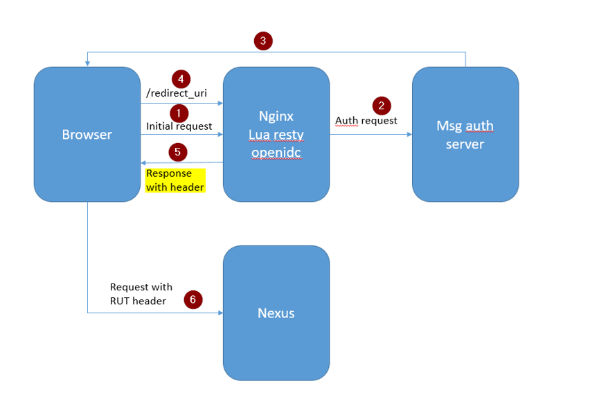
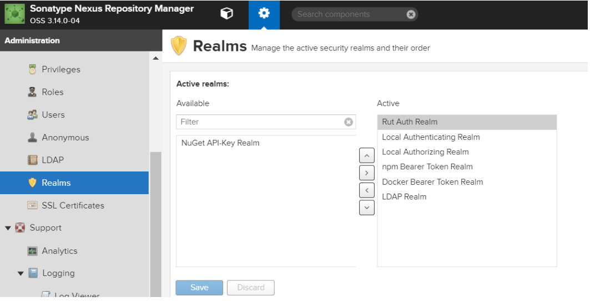
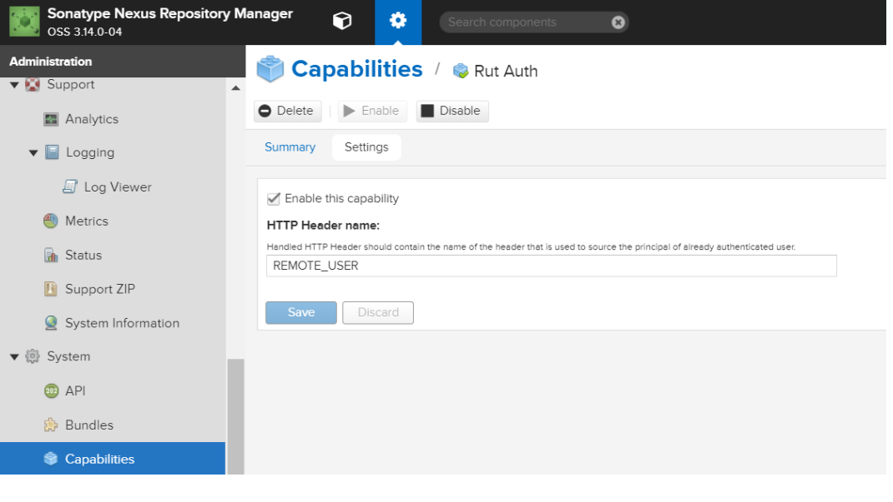

# Openresty-sso
OIDC SSO implementation in reverse proxy for Nexus

# Nexus-SSO

**Implementing SingleSignOn in Nexus using reverse proxy.**

Nexus **does not support Oauth or SAML** for SSO implementation but with workaround it is possible to achieve SSO in Nexus.

**How ?**

Nexus oss allows to configure login based on RUT (Remote user authentication) where the user ID can be passed which is authenticated to browser header. Nexus accepts login but
LDAP with authorization should be configured before we enable RUT.

**How do we get user ID from browser or Browser saved cookies?**

      - Configure Nginx (Reverse proxy) to communicate with Auth system for authentication.

      - After successful authentication from Auth server get user ID from response and pass it to Nexus as HTTP header.

To achieve above steps we need Nginx library called Openresty and some of its dependency components.

OpenResty   is a superset of the nginx web server, but bundled with LuaJIT, a just-in-time compiler for the Lua scripting language and with many other useful Nginx modules 
and Lua libraries. This includes lua-resty-openidc library as well.

How to install ?

For configuring Open Resty Server (NGINX as RP) we need the following additional dependencies.

  * gcc
*   libpcre3 libpcre3-dev
*   libssl-dev
*   lua5.1
*   lua-resty-http
*   lua-resty-session
*   lua-resty-jwt

Below are the steps involved to get openresty and its other dependency components installed. Below commands based on alpine linux.

*echo "Installing required packages for OpenResty"

apk --update add --virtual .build_deps build-base zlib-dev pcre-dev libressl-dev make openssl-dev gnupg libxslt-dev perl-dev

apk --update add pcre libbz2 ca-certificates libressl gcc  libpcre3 libpcre3-dev libc-dev linux-headers gd-dev geoip-dev
"Installing and compilation of OpenResty“

curl https://openresty.org/download/openresty-1.15.8.1.tar.gz -o /tmp/openresty-1.15.8.1.tar.gz

tar -xvf /tmp/openresty-1.15.8.1.tar.gz

cd openresty-1.15.8.1 \
&& ./configure  --sbin-path=/usr/local/bin/nginx --conf-path=/home/appuser/app/nginx.cnf  --error-log-path=stderr --http-log-path=/dev/stdout --pid-path=/home/appuser/app/nginx.pid -j2  --lock-path=/home/appuser/app/nginx.lock  --http-client-body-temp-path=/home/appuser/app/client_temp  --http-proxy-temp-path=/home/appuser/app/proxy_temp  --http-fastcgi-temp-path=/home/appuser/app/fastcgi_temp  --http-uwsgi-temp-path=/home/appuser/app/uwsgi_temp  --http-scgi-temp-path=/home/appuser/app/scgi_temp \
 && make -j2 \
  && make install
  
export PATH=/usr/local/openresty/bin:$PATH

export PATH=/usr/local/openresty/luajit/bin:$PATH

mkdir /usr/local/openresty/site/lualib/resty

curl https://opm.openresty.org/api/pkg/tarball/zmartzone/lua-resty-openidc-1.7.2.opm.tar.gz -o /tmp/lua-resty-openidc-1.7.2.opm.tar.gz

tar -zxvf /tmp/lua-resty-openidc-1.7.2.opm.tar.gz -C /tmp/lua-resty-openidc-1.7.2.opm

cp /tmp/lua-resty-openidc-1.7.2.opm/lib/resty/openidc.lua  /usr/local/openresty/site/lualib/resty/openidc.lua

"Installing opm packages"
opm install bungle/lua-resty-session 

opm install cdbattags/lua-resty-jwt

opm install pintsized/lua-resty-http

opm install zmartzone/lua-resty-openidc

**What?** - lua-resty-openidc is a library for NGINX implementing the OpenID Connect Relying Party (RP) and the OAuth 2.0 Resource Server (RS) functionality. 
 

**How?**- OpenID Connect Relying Party it authenticates users against an OpenID Connect Provider using OpenID Connect Discovery. Upon the user giving consent, that it will
gather user information from the OpenID Provider and if the user is authorized, forward the user to a redirect URI.
 

**Why?** -  You can secure your applications with OAuth without any application-side changes. All your application servers sitting behind NGINX will know nothing about user 
authentication. NGINX will do the authentication on behalf of the applications and send the authorized user claims as custom headers to the back-end.

**Configuration required on Nexus (Enabling RUT)**

1. Add Rut Auth Realm  to Active in  Realms window 

2. And also need to add HTTP header in Capabilities for Rut Auth. This header is used to send the userId of Authorized User from nginx. 

**Nginx configuration**

Pre-requisites:  Client ID and Secret ID should be registered with Auth server before configuring Nginx. 

**And also valid callback URL need to be set to allow all sub domains in your auth server otherwise callback would fail.**

Below is the Nginx configuration block for Nexus. before routing to Nexus we are calling Lua script which initiates the communication with Auth server.

*server {

    resolver 127.0.0.11;
    
    listen       8443;
    
    server_name  your_server_name;
    
    ssl on;
    
    ssl_certificate      /path/to/cer.pem;
    
    ssl_certificate_key  /path/to/key.pem;
    
    access_log  /path/to/access_nexus-prd-01.log;
    
    error_log   /path/to/error_nexus-prd-01.log;
    
    error_page   500 502 503 504  /50x.html;
    
    # set client body size to 1000M #
    
    client_max_body_size 1000M; 
    
    set $session_secret 723p4hR234t36VsCD8g565325IC0022G;
    
    location / {
    
    access_by_lua_file /path/to/oidc.lua;
    
    proxy_pass https://server_name:8443/;
    
    proxy_set_header Host $host;
    
    }
 
}
 *

**Lua script : **

Authentication variables to be set : We need to configure the Client ID and Secret ID in lua script as variables. 
Below is the block of lua script where Auth server details are configured.

*local opts = {

    -- Redirect uri which doesn't exist and cannot be '/'
    
    redirect_uri_path = "/redirect_uri",
    
   discovery = "https://your_auth_server/.well-known/openid-configuration",
   
  client_id = "test-gba-nexus",
  
  client_secret = "aca0ca81-d001-4662-a146-b51ca44c81af",
  
    ssl_verify = ngx.var.oidc_ssl_verify or "no",
    
    redirect_uri_scheme = "https",
    
    logout_path = ngx.var.oidc_logout_path,
    
    scope = "openid profile",
    
    redirect_logout_url = not (ngx.var.oidc_redirect_logout_url == "false"),
    
    -- Prevent 'client_secret' to be nil:
    
    -- https://github.com/pingidentity/lua-resty-openidc/blob/v1.5.3/lib/resty/openidc.lua#L353
    
    token_endpoint_auth_method = "client_secret_post",
    
    --refresh_session_interval = 900,
    
    --access_token_expires_in = 3600,
    
    --force_reauthorize = false
}*

